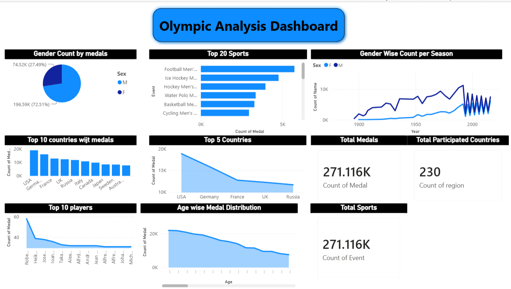

## Olympic Analysis Dashboard – Athlete & Medal 

This page provides a detailed analysis of Olympic athletes, medals, events, and regional participation through various interactive visualizations.

### Features

- **Gender Distribution Analysis**
  - Pie chart showing medal distribution by gender.
  - Helps compare male and female athlete participation and achievements.

- **Regional Medal Performance**
  - Clustered column chart displaying medal counts across different regions.
  - Identifies top-performing countries/regions in Olympic events.

- **Athlete Performance Insights**
  - Stacked area chart visualizing medals won by athletes.
  - Highlights athletes with significant Olympic achievements.

- **Event-wise Medal Analysis**
  - Bar chart showing medal distribution across Olympic events.
  - Helps identify events with higher competition and medal counts.

- **Age-Based Performance Analysis**
  - Area chart displaying the relationship between athlete age and medal achievements.
  - Provides insights into peak performance age groups.

- **Yearly Participation Trends**
  - Line chart analyzing athlete participation over different Olympic years.
  - Useful for understanding long-term Olympic participation patterns.

### Key Performance Indicators (KPIs)

The dashboard includes summary cards for:

- Total Medals Won
- Total Participating Regions
- Total Olympic Events

### Tools Used

- Power BI Desktop
- Data Cleaning and Transformation
- Interactive Visualizations
- Olympic Athlete Events Dataset

### Insights Generated

- Comparison of medal distribution by gender.
- Identification of top-performing regions.
- Analysis of athlete achievements across events.
- Age and participation trends over Olympic history.
- Event-wise medal distribution patterns.

### Dashboard Preview

